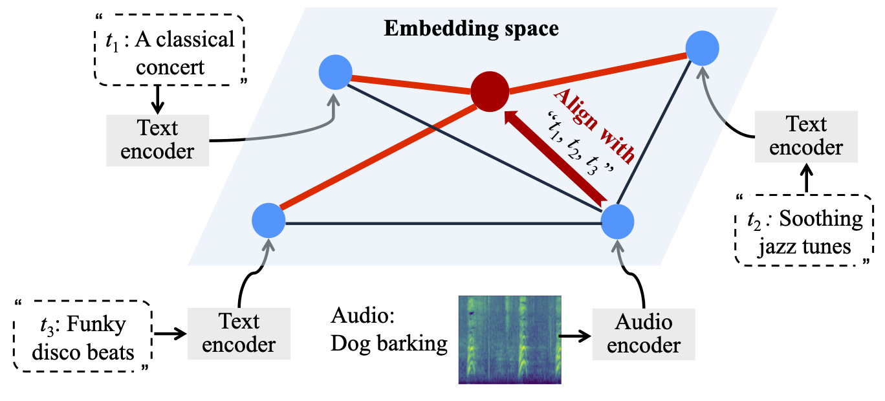

<h1 align="center"> 
Adversarial Hubness in Multi-Modal Retrieval </h1>

<p align="center"> <i>Tingwei Zhang, Fnu Suya, Rishi Jha, Collin Zhang, Vitaly Shmatikov</i></p>

Abstract—Hubness is a phenomenon in high-dimensional vector spaces where a point from the natural distribution is unusually close to many other points. This is a well-known problem in information retrieval that causes some items to
accidentally (and incorrectly) appear relevant to many queries.

In this paper, we investigate how attackers can exploit hubness to turn any image or audio input in a multi-modal retrieval system into an adversarial hub. Adversarial hubs can be used to inject universal adversarial content (e.g., spam) that will be retrieved in response to thousands of different queries,
and also for targeted attacks on queries related to specific, attacker-chosen concepts.

We present a method for creating adversarial hubs and evaluate the resulting hubs on benchmark multi-modal retrieval datasets and an image-to-image retrieval system implemented by Pinecone, a popular vector database. For example, in text-caption-to-image retrieval, a single adversarial hub, generated using 100 random queries, is retrieved as the top1 most relevant image for more than 21,000 out of 25,000 test queries (by contrast, the most common natural hub is the top-1 response to only 102 queries), demonstrating the strong generalization capabilities of adversarial hubs. We also investigate whether techniques for mitigating natural hubness can also mitigate adversarial hubs, and show that they are not effective against hubs that target queries related to specific concepts.

Paper link:
[https://arxiv.org/pdf/2412.14113](https://arxiv.org/pdf/2412.14113)



Most experiments run on a single NVIDIA A40 40g GPU.

# Installation
1. **Setup Environment:** run `conda env create -f environment.yml`.
2. **Download Data:** Experiments use MSCOCO, CUB_200_2011, and AudioCaps datasets. For convenience, all necessary gallery and query embeddings for each dataset and encoder are provided as a release. To set up, download `data.zip`, then from the project root directory, run: `unzip /path/to/data.zip -d .`.
3. **AudioCLIP Checkpoints:** To conduct any experiments on AudioCLIP, we require pretraining checkpoints.
    - Create the checkpoint directory:
      ```
      mkdir -p bpe/
      ```
    - For the full checkpoint, run:
      ```
      wget https://github.com/AndreyGuzhov/AudioCLIP/releases/download/v0.1/AudioCLIP-Full-Training.pt -P bpe/
      ```
    - For the partial checkpoint (used for transfer attacks):
      ```
      wget https://github.com/AndreyGuzhov/AudioCLIP/releases/download/v0.1/AudioCLIP-Partial-Training.pt -P bpe/
      ```

# Adversarial Hub Demo
Run `python hubness.py configs/imagebind/mscoco_imagebind_sample_100_eps_16.toml`.
The result will be saved in `outputs/mscoco/imagebind/imagebind_sample_100_eps_16`.

# Experiments

Experiments in this repo are run with `hubness.py` and configured by TOML files under `configs/`.  
Hyperparameter descriptions are documented in `configs/hubness_explanation.toml`.

Some runnable examples:

- **MSCOCO (vision):**
  - `python hubness.py configs/imagebind/mscoco_imagebind_sample_100_eps_16.toml`
  - `python hubness.py configs/openclip/mscoco_openclip_sample_100_eps_16.toml`
- **CUB_200 (vision):**
  - `python hubness.py configs/imagebind/cub_200_imagebind_sample_100_eps_16.toml`
  - `python hubness.py configs/audioclip/cub_200_audioclip_sample_100_eps_16.toml`
- **AudioCaps (audio):**
  - `python hubness.py configs/imagebind/audiocaps_imagebind_sample_100_eps_16.toml`
  - `python hubness.py configs/audioclip/audiocaps_audioclip_sample_100_eps_16.toml`


Please feel free to email: [tz362@cornell.edu](mailto:tz362@cornell.edu) or raise an issue.